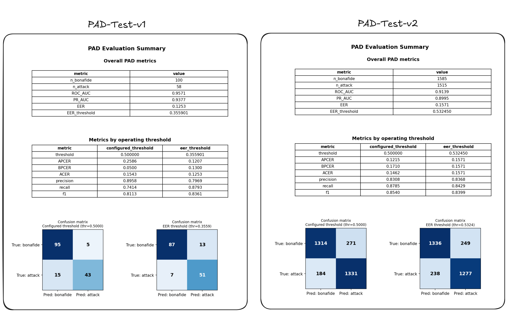

# Method 3: DeepFace (off-the-shelf reference)

A third, exploratory approach to the same Screen Attack Detection PAD
exercise as `../FFT_SVM` and `../MiniFASNet`. Instead of training or
fine-tuning anything, this wraps [DeepFace](https://github.com/serengil/deepface)'s
built-in anti-spoofing model (`DeepFace.extract_faces(..., anti_spoofing=True)`)
with the same CLI conventions used elsewhere in this repo, so it can be run
and compared the same way.

Worth knowing before treating this as an independent third method:

* DeepFace's anti-spoofing backend is itself an ensemble of two MiniFASNet models at 2.7x and 4x crop scales,
  run entirely off the shelf, no fine-tuning on our data at all.
* It is the same model family `../MiniFASNet` fine-tunes from, run as originally trained rather than
  adapted to this dataset.

The above points makes it a genuinely useful reference point (what does the properly-calibrated, dual-scale original
ensemble get,
before any of our fine-tuning choices come into play?), not an unrelated baseline.

## Setup

```bash
pip install deepface
```

DeepFace downloads its own model weights (face detector + FasNet) on first
use, cached locally afterward. No local training artifacts are needed since
nothing here is trained by us.

## Inference

```bash
python infer.py --input_dir path/to/images --output_dir annotated/
```

- Writes one annotated image per input to `--output_dir`:
    - Green box + `REAL <score>` for genuine predictions
    - Red box + `SPOOF <score>` for attack predictions
    - Also shows the face detector's own confidence
- Writes `results.csv` (in `--output_dir`, or wherever `--output_csv` points) with one row per image:
  `filename, model_predicted_label, model_confidence, flag`

**Optional - audit a labeled folder for mislabeled examples:**

If every image in a folder shares a known ground-truth label, pass `--known_label real` or `--known_label spoof` to flag
disagreements between DeepFace's prediction and that label:

```bash
python infer.py --input_dir datasets/PAD-test-v1/real \
    --output_dir annotated/real --known_label real
python infer.py --input_dir datasets/PAD-test-v1/spoof \
    --output_dir annotated/spoof --known_label spoof
```


## Evaluation

`val.py` is eval-only: it always scores against ground truth.

```bash
python val.py --input_dir /path/to/data --output_csv scores.csv
```

- `--input_dir` points at a folder laid out like the training data (`real/` and `spoof/` subfolders)
- For a flat folder instead, use `--labels_csv labels.csv` with columns `filename,label`
- Evaluation metrics on **PAD-Test-v1** and **PAD-Test-v2** is saved in `eval_pad_test_v1` and `eval_pad_test_v2` respectively



**How the attack score is derived:**

- `DeepFace.extract_faces` returns `is_real` (bool) and `antispoof_score` - the confidence of *whichever* label won (see
  `FasNet.analyze`: the winning class's softmax probability, not a consistently-oriented `P(real)` or `P(attack)`)
- To get a single continuous attack-likelihood score for ROC/PR curves, `val.py` derives:

```
attack_score = antispoof_score       if is_real is False
attack_score = 1 - antispoof_score   if is_real is True
```

- `--threshold` (default `0.5`) is where that derived score flips relative to DeepFace's own `is_real` decision - its
  actual decision boundary, since there's no separate tunable threshold exposed by the public API the way there is for
  our own fine-tuned models

## Known limitations / what would break this

- This is an off-the-shelf model with no visibility into or control over
  its training data, so there's no way to know whether it has already seen
  images similar to ours, or how it would perform on attack types not
  represented in whatever it was originally trained on.
- The derived `attack_score` is an approximation (see above) built from
  `is_real` + a single winning-class confidence, not the model's full
  3-class probability vector (print / live / replay), which isn't exposed
  by the public API. A more faithful score would need that full vector.