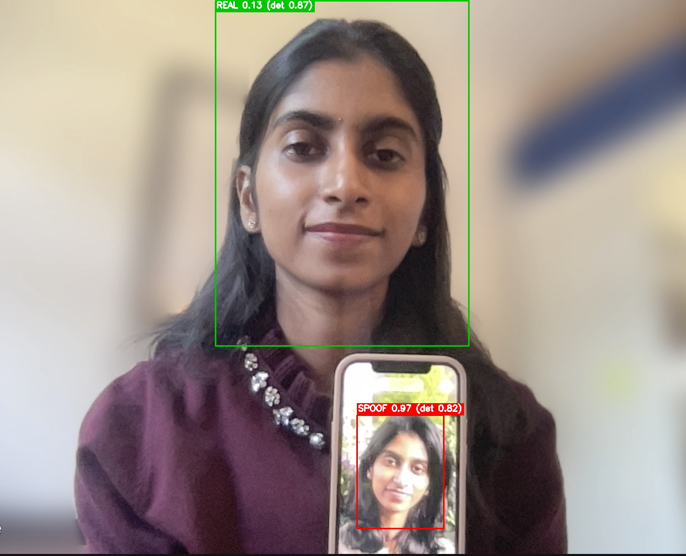
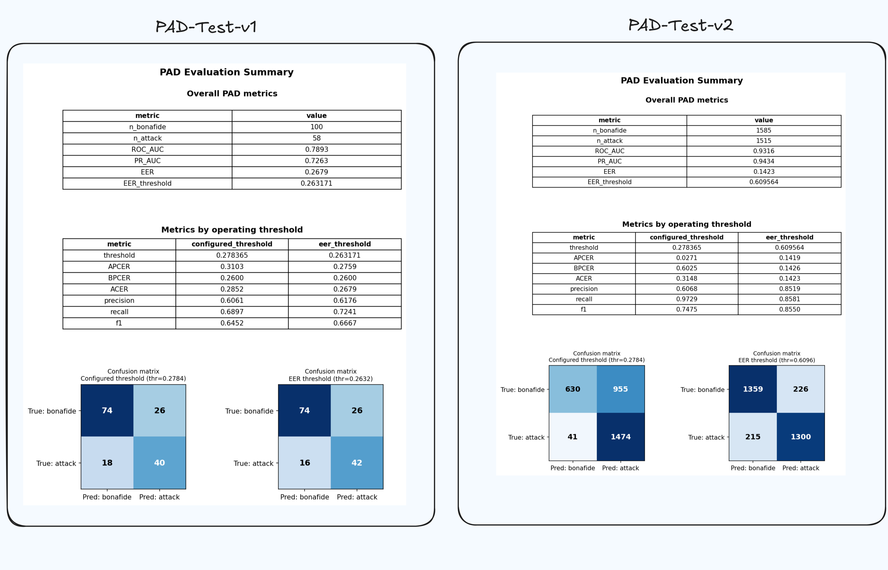

# Method 2: Fine-tuned MiniFASNetV2 (Silent-Face-Anti-Spoofing)

Fine-tunes the `2.7_80x80_MiniFASNetV2` checkpoint from
[minivision-ai/Silent-Face-Anti-Spoofing](https://github.com/minivision-ai/Silent-Face-Anti-Spoofing)
(vendored under `../Silent-Face-Anti-Spoofing`) on our own real/spoof data,
instead of training a network from scratch.

## Why fine-tune this checkpoint

- Our real/spoof dataset is far smaller than what training a MiniFASNet
  from scratch would need. Starting from pretrained weights keeps the
  backbone's learned texture/frequency features and only adapts them to
  this data.
- Training uses `datasets/train/PAD-v7` (the data used for the final
  deployed model, `artifacts/m2.v7`), whose crops are taken at the same
  2.7x bounding-box margin the checkpoint was originally trained on.
  `infer.py` defaults `--crop_scale` to 1.5x instead, though: the
  validation/test data itself is cropped at 1.5x, and matching that at
  inference gave a tighter, more accurate face boundary and better
  eval/inference results than 2.7x.

## Setup

```bash
pip install -r requirements.txt
```

Tested with Python 3.8, PyTorch 1.11 (CUDA 11.3). 

## Data preparation

```bash
python data_prep.py --source_dir D:/assignment/datasets/train/PAD-v7 \
    --output_dir ./data --val_frac 0.15
```

Stratified real/spoof split into `data/train/{0,1}` and `data/val/{0,1}`
(0 = real, 1 = spoof). `data/val` is used by `finetune.py` for per-epoch
validation and checkpoint selection, not just a final check.

## Train

```bash
python finetune.py --data_dir ./data --epochs 25 --batch_size 128 --lr 1e-3
```

The checkpoint with the lowest validation ACER is kept as `best.pth`.

Outputs to `artifacts/`: `model_{epoch_n}.pth`, `best.pth`, `config.json`
(architecture, decision threshold, validation metrics), and
`training_history.json` (per-epoch curve).

## Inference

`infer.py` runs the full pipeline on raw, uncropped photos: 
- YOLOv8n-face detection 
- bbox expansion (`--crop_scale`, default 1.5x)
- classification with the exported ONNX model.

```bash
# single image
python infer.py --input_image path/to/photo.jpg --output_image annotated.jpg \
    --pad_model artifacts/m2.v7/model.onnx --pad_config artifacts/m2.v7/config.json

# a folder of images -> annotated folder + CSV
python infer.py --input_dir path/to/images --output_dir annotated/ \
    --pad_model artifacts/m2.v7/model.onnx --pad_config artifacts/m2.v7/config.json
```

**Green box** = bona fide, **red box** = spoof, with the classifier's confidence
and the face detector's own confidence shown alongside.



## Evaluation

`val.py` is eval-only: it scores a labeled folder and always computes PAD
metrics against ground truth.

```bash
python val.py --input_dir /path/to/data --output_csv scores.csv \
    --model_dir ./artifacts/m2.v7
```

- `--input_dir` needs `real/`/`spoof/` subfolders (or use `--labels_csv
labels.csv` for a flat folder). 
- Writes per-image scores to `--output_csv`, and to `--metrics_output_dir`




**Current results**: EER of 0.26 on PAD-test-v1 and 0.61 on PAD-test-v2,
averaged to 0.43 as a single headline number. That averaging is a
shortcut, not a rigorous way to combine two differently-sized, differently
distributed test sets (see limitations below).

## Known limitations

- **Dataset size**: the real/spoof counts here are small relative to what
  this kind of model typically needs; likely the single biggest factor
  behind the v1/v2 performance gap.
- **Limited diversity**: the data doesn't cover a wide range of gender,
  age, or ethnicity. A more representative dataset would likely generalize
  better and close some of that gap.
- **Crop-scale mismatch**: training crops (`PAD-v7`) use a 2.7x margin,
  matching the checkpoint, while `infer.py` defaults to 1.5x - chosen to
  match the validation/test data's own crop convention, and empirically
  the better choice at eval/inference time. Not a fully resolved question
  though: a model fine-tuned end-to-end on 1.5x crops from the start might
  do even better than adapting a 2.7x-trained model to a 1.5x input only
  at inference.
- **Evaluation strategy**: reporting a plain average of the two test sets'
  EERs isn't ideal; pooling raw scores or reporting per-set metrics
  separately (as done above) would be more honest than one blended number.
- No landmark-based face alignment (deliberately - rotation/interpolation
  can smear the high-frequency moire signal this method partly relies on).

With more time, the dataset (size, diversity) and evaluation methodology
are where effort would go first - the modeling choices here are secondary
to those two.
